# Cebu Profiler



**Shrink a huge model. Prove it still works. Fail closed.**

Cebu Profiler is a model-agnostic, inside-the-model analysis and
derivative-building platform. It measures what is inside a large transformer /
MoE checkpoint and turns that evidence into a smaller, evidence-driven
derivative: tensor census → streamed REAP profiling → keep-map planning →
checkpoint conversion → repair/distillation → serving.

Three properties define the pipeline:

- **Evidence first.** Nothing is pruned, quantized, or reshaped on a hunch —
  every intervention cites measured saliency, contribution, or causal evidence.
- **Fail closed.** Missing evidence, malformed keep-maps, or a failed quality
  gate stops the pipeline with a recorded rejection. Estimated values are never
  presented as measured ones.
- **Model-agnostic.** Kimi K3 is the first registered subject (2.78T params,
  104B active, 896 routed experts/layer top-16, Stable LatentMoE, MXFP4
  experts, ~1.56 TB). The core is driven by a configurable `ArchitectureSpec`;
  other large models register as additional architectures.

## How it works

1. **Profile** — census every tensor and layer; establish ownership so no
   tensor is unclassified and source identity is preserved.
2. **Recommend** — pick the compression method the evidence supports.
3. **Compress** — GGUF-mixed quantization, or saliency-ranked 16-channel
   expert width-slicing with router indices and correction biases reordered
   exactly in step.
4. **Verify & hand off** — structural checks, a teacher KLD/CKA quality gate
   against the original model on the same prompts, then a hash-verified run
   bundle for serving.

## Intent (one clear purpose per app)

- **`eval-lab`** — *measure* model/agent capability with deterministic
  evidence. Separate project; stays a harness only.
- **`cebu-profiler`** — *shrink or reshape a large base model into a smaller,
  evidence-driven derivative.* This repo.
- **Bridge** — an optional plugin, added only when a user wants `eval-lab`'s
  label ontology / holdout evals to validate a Cebu Profiler derivative. Not a
  baked-in dependency. Dependency edge is one-way: `cebu-profiler → eval-lab`.

## Method-agnostic evidence

The profiler records a rich, per-expert / per-layer evidence base (saliency,
routing frequency, contribution norms, routing entropy, quantization
sensitivity, substitution). Any compression method — REAP, AQLM low-bit,
EXL3/EXO quant formats, or a maestro-style orchestrator — is scored against the
same evidence rather than hard-wired.

## Subsystems (crisp modules, not one blob)

1. `census` — tensor census + ownership (every tensor, layerwise, source
   identity preserved; no unclassified).
2. `profiler` — streamed layerwise REAP analysis (saliency by label/stage).
3. `analysis` — v3 fidelity-first analyzers (spectral, semantic,
   quantization-sensitivity, routing consistency, and more).
4. `planning` — byte-accurate memory + keep-map planner, width buckets,
   protection of attention/shared/backbone components.
5. `compression` — backend registry, quantization math, per-expert response
   curves.
6. `executor` — structural application of plans to a model clone.
7. `serving` — two-node / elastic runtime.
8. `dashboard` — interactive HTML dashboard rendered from measured artifacts.
9. `kernels` — versioned runtime-kernel evidence receipts (fail-closed oracle).

## Current status

Working end-to-end on the synthetic mini-MoE subject: tensor census,
architecture registry, streamed profiling, v3 fidelity-first analysis
pipeline, width-slice planning under byte-accurate budgets, structural
execution, quality gates, and the dashboard. Real-checkpoint compression
arrives against measured evidence in later milestones — no pruning decisions
are made on this scaffold alone.

## Quickstart

```bash
python -m venv .venv && . .venv/bin/activate
pip install -e ".[dev]"
cebu-profiler doctor
cebu-profiler list-architectures
cebu-profiler census k3-mini
cebu-profiler plan k3-mini --budget-gb 0.001 --node-budget-a-gb 0.0006
```

Run `cebu-profiler --help` for all commands.

## Runtime-kernel evidence

Cebu Profiler imports versioned kernel benchmark receipts without owning the
CUDA implementation. Exact measured direct-kernel observations can gate
candidate runtime selection; CPU/reference checks and estimates remain visible
but cannot be ranked as speed evidence. Model IDs, operator names, phases,
representations, and ABIs are data rather than allowlists, so new models do not
require bridge code changes. See the
[Kernel Evidence Bridge](https://github.com/Kristianaaron/cebu-profiler/blob/main/docs/kernel-evidence-bridge.md).

## License

Apache-2.0.
