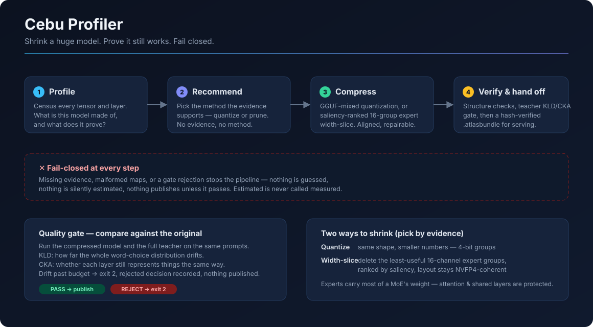

# Cebu Profiler

<p align="center">
  
</p>

**A fail-closed pipeline that shrinks enormous MoE models into smaller, verified
derivatives — and refuses to publish anything it cannot prove.**

Cebu Profiler measures what is inside a large transformer/MoE checkpoint and
turns that evidence into a smaller derivative candidate: tensor census →
evidence profiling → method recommendation → compression → quality gate →
verified handoff. It is **model-agnostic**: registered subjects include
**GLM-5.2** (NVIDIA NVFP4, 78 layers, 256 routed experts, top-8) and
**Kimi K3** (2.78T params, 104B active, 896 experts/layer top-16), driven by a
configurable `ArchitectureSpec`.

---

## What the pipeline does, in plain terms

Think of it as an assembly line that takes a model too big to run and produces
a smaller one you can prove still behaves like the original.

1. **Profile** — *Take inventory.* Read the checkpoint's safetensors headers and
   classify every one of the hundreds of thousands of tensors: which layer,
   attention or expert, what shape, what role. Nothing gets skipped — the census
   must be 100% classified before anything else happens.

2. **Recommend** — *Pick a method the evidence supports.* Each compression
   method (quantize, width-slice) declares what evidence it needs. The
   recommender only marks a method *executable* if the profile actually carries
   that evidence. If it doesn't, the method is **blocked** — honestly, with the
   reason. Evidence is typed (`measured` / `estimated` / `predicted` /
   `inferred` / `causally_tested`) and predictions are never presented as
   measured.

3. **Compress** — *Make it smaller, coherently.* Two methods ship today:
   - **Quantize (GGUF-mixed):** same shape, smaller numbers — mixed-precision
     4-bit assignment by layer sensitivity.
   - **Width-slice:** for MoE experts — delete the *least useful* 16-channel
     groups, ranked by saliency, per layer and per expert. Groups align with
     the NVFP4 quantization layout so the checkpoint stays structurally valid.
     In a MoE the experts carry most of the weight; attention and shared layers
     are protected.

4. **Verify & hand off** — *Prove it, then ship it.* The materialized
   derivative passes structural validation, is packed into a content-addressed
   `.atlasbundle`, and is loadable only through a hash-verifying handoff. A
   separate **quality gate** compares the compressed model against the full
   teacher: **KLD** (how far the output distribution drifts) and **CKA**
   (whether each layer still represents things the same way). Drift past
   budget → rejected decision recorded, **nothing published, exit code 2**.

### The one rule: fail closed

Every stage either completes with verifiable evidence or stops the pipeline.
No silent fallbacks, no guessed values, no "estimated" quietly upgraded to
"measured", no bundle published without hash verification. A pipeline that
can't prove its work refuses to ship it.

---

## Status

- **Quantize path:** production-proven end-to-end (profile → recipe → GGUF-mixed
  build → validate → verified handoff).
- **Width-slice path:** full chain landed — saliency evidence emission, ranked
  keep-map builder, `--dry-run`/`--execute` runner with atomic staging,
  structural validation, bundle + verified handoff, teacher KLD/CKA gate with
  exit-2 rejection. Mechanism validated end-to-end on synthetic NVFP4 fixtures;
  first real-model slice is a measured-capture run away.
- Real checkpoint metadata census proven on GLM-5.2-NVFP4 (232,385 tensors /
  47 shards / ~465 GB, 100% classified, structural graph valid).

## Quickstart

```bash
python -m venv .venv && . .venv/bin/activate
pip install -e ".[dev]"
cebu-profiler doctor
cebu-profiler list-architectures
cebu-profiler census k3-mini
cebu-profiler plan k3-mini --node-a-gb 0.001 --node-b-gb 0.001
cebu-profiler preflight --out capability_report.json
```

Width-slice runner:

```bash
# plan only — no writes
python scripts/run_glm52_width_slice.py --source <checkpoint_dir> --out <out_dir>

# execute: ranked keep-map → materialize → validate → .atlasbundle → verified handoff
python scripts/run_glm52_width_slice.py --source <checkpoint_dir> --out <out_dir> --execute

# explicit quality gate (separate step, by design)
python scripts/run_glm52_width_slice.py --source <checkpoint_dir> --out <out_dir> \
    --execute --metric-report <CaptureMetricReport.json> --kld-budget 0.10 --cka-budget 0.05
```

Run `cebu-profiler --help` for all commands. Tests: `pytest` (fast) /
`pytest -m ""` (full) / `pytest -m integration`.

## Intent (one clear purpose per app)

- **`eval-lab`** — *measure* model/agent capability with deterministic evidence.
  Separate project; stays a harness only.
- **`cebu-profiler`** — *shrink or reshape a large base model into a smaller,
  evidence-driven derivative.* This repo.
- **Bridge** — an optional plugin, added only when a user wants `eval-lab`'s
  label ontology / holdout evals to validate a Cebu derivative. Dependency edge
  is one-way: `cebu-profiler → eval-lab`.

## Method-agnostic evidence

The profiler records a rich per-expert / per-layer evidence base (saliency,
routing frequency, contribution norms, routing entropy, quantization
sensitivity, substitution). Any compression method — REAP, AQLM low-bit,
EXL3/EXO quant formats, or a maestro-style orchestrator — is scored against the
same evidence rather than hard-wired. Evidence is typed
(`measured` / `estimated` / `predicted` / `inferred` / `causally_tested`);
predictions are never presented as measured and are never deployable.

## Subsystems

| Subsystem | What it does |
|---|---|
| `census` | Tensor census + ownership — every tensor, layerwise, source identity preserved, no unclassified |
| `checkpoint` | Safetensors header census, hash-verified source manifest, structural graph, synthetic fixture builder |
| `atlas` | Streamed layerwise REAP analysis + v3 fidelity-first pipeline (spectral / routing-consistency / NVFP4 / KV / Pareto) |
| `scoring` | TENP, grouped-Taylor surrogate, causal, stability, semantic, redundancy, quant-sensitivity |
| `planning` | Byte-accurate memory planner, rate-distortion optimizer, typed `CandidatePlan`s, INSUFFICIENT_EVIDENCE gate |
| `builder` | Derivative builder from a `CandidatePlan` (coupled gate/up/down surgery, router remap, provenance) |
| `recommend` | Method catalog + evidence-gated executability (fail-closed) |
| `prune` | Width sizing, uniform-width planning, saliency-ranked 16-group keep-maps |
| `evaluation` | Teacher-relative KLD/CKA capture metrics + quality-gate decisions |
| `serving` | Two-node expert-parallel assignment + fit, elastic NVMe-overflow simulation, KV ledger |
| `preflight` | Machine-readable capability/preflight report |
