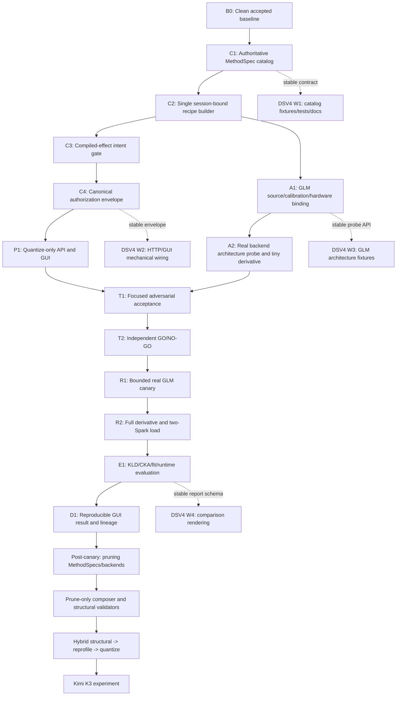

# Atlas finish-to-test execution graph

Status: active execution contract. This supersedes the earlier feature-complete
graph for scheduling purposes. The earlier graph remains the long-term product
map; this document defines the shortest safe route to a real GLM-5.2 test.

## Outcome and boundary

The immediate deliverable is one reproducible browser-driven run:

`profile -> recommend quantize_only -> review exact recipe -> authorize -> compress -> validate -> run on 2x Spark -> KLD/CKA/runtime comparison`

Pruning, hybrid composition, Kimi K3, broad paper-method coverage, and polished
candidate exploration must not block this canary. Their contracts remain visible
and fail-closed, then are implemented after the quantization path is proven.

## Definition of done for the GLM canary

All conditions are mandatory:

1. The GUI accepts a real Atlas profile and a two-Spark memory target.
2. `quantize_only` produces a recommendation with exact available/blocked reasons.
3. One immutable recipe is the sole source for preview, digest, compiled artifact,
   authorization, start, resume, validation, and lineage.
4. The compiled recipe contains at least one quantization effect and no structural
   pruning effect.
5. Model source, calibration identity, tokenizer/profile identity, hardware target,
   backend pins, policy version, and catalog digest are bound into authorization.
6. The real GLM checkpoint is transformed by a pinned derivative-producing backend.
7. The derivative passes checkpoint validation and loads on two DGX Sparks.
8. A bounded prompt suite completes and records token KLD, CKA where available,
   routing/fit/runtime evidence, memory peaks, throughput, and output hashes.
9. The complete run can be reproduced or safely resumed from persisted artifacts.
10. An independent audit returns GO on the exact tested commit and artifact lineage.

## Ownership rule

The primary Codex agent owns any task involving intent semantics, method/effect
classification, source/target identity, recipe construction, authorization,
artifact digests, promotion, runtime operations, or cross-branch integration.

DSV4 workers receive only bounded mechanical packets after the parent has fixed
their input/output contracts. Suitable work includes GUI rendering, HTTP request
plumbing, adapter architecture tables, fixtures, focused tests, documentation,
and deterministic serializers. DSV4 runs with `--thinking high`, never max.

Independent agents review read-only and never repair their own findings. The
primary agent performs or assigns the smallest correction, then requests a fresh
audit.

## Critical-path graph

## Work packets and gates

### B0 — Baseline snapshot

Owner: primary. Timebox: 10 minutes.

- Require clean worktree and record commit.
- Record GPU service PIDs/memory without mutation.
- Fingerprint the GLM source, tokenizer/config, existing derivatives, free disk,
  and the two-Spark runtime topology.
- Record the exact focused suite used as regression baseline.

Gate: no unowned changes; source and live services have immutable identities.

### C1 — Authoritative MethodSpec catalog

Owner: primary. Timebox: 45 minutes.

- Replace parallel maps with one versioned `MethodSpec` catalog.
- Each entry declares method ID, family, backend ID, evidence requirements,
  recipe stage IDs, expected compiled effect classes, formats, status, paper IDs,
  and compatible intents.
- Explicit families include `analysis`, `conditioning`, `allocation`,
  `quantization`, `pruning`, `refinement`, `residual`, `recovery`, `kv`, and
  `evaluation`.
- Unknown methods and incomplete specs fail closed.
- Canonical catalog JSON has a SHA-256 digest and policy version advances.

Gate: a synthetic pruning method cannot pass `quantize_only`; catalog order does
not change its digest; changing any execution-relevant field does.

DSV4 W1 after contract freeze: build catalog fixtures, serialization tests,
paper/provenance documentation, and negative cases in an isolated worktree.

### C2 — Single session-bound recipe builder

Owner: primary. Timebox: 60 minutes.

- Construct exactly one recipe from the authorized profile, immutable source,
  calibration/tokenizer identity, requested target, constraints, and MethodSpecs.
- Preview, compile, artifact creation, recipe SHA, plan ID, persisted preview,
  start, and resume consume this same object.
- Remove the sessionless-preview/session-bound-artifact split.
- Assert artifact recipe SHA equals preview/package recipe SHA.

Gate: non-default memory, hardware, source, and calibration each alter identity;
the persisted artifact and returned digest are byte-consistent.

### C3 — Compiled-effect intent gate

Owner: primary. Timebox: 35 minutes.

- Derive actual families from compiled `StageEffectClass`, never method labels.
- `quantize_only`: >=1 quantization, zero pruning.
- `prune_only`: >=1 pruning, zero quantization.
- `hybrid`: >=1 of each, with structural output preceding re-profile/quantize.
- `custom`: exact user-declared effect set bound into authorization.
- Today, prune/hybrid remain visible but non-executable until real stages exist.

Gate: label/stage mismatches, empty compression selections, hidden pruning, and
analysis-only starts all fail before artifact publication.

### C4 — Canonical authorization envelope

Owner: primary. Timebox: 45 minutes.

- Bind policy/catalog versions and digest, recommendation ID, method specs,
  selected methods, compiled effects, source/calibration/tokenizer/profile,
  target, constraints, recipe/plan/artifact identities, and TTL/revocation state.
- Validate JSON booleans strictly; never coerce strings.
- Recheck the complete envelope at preview and start, not only method names.
- Any backend availability, family, recipe, source, or policy drift makes the
  token stale.

Gate: mutation matrix proves every bound field invalidates authorization.

### P1 — Quantize-only API and GUI

Owner: DSV4 W2 after C1-C4 contracts; primary integrates. Timebox: 35 minutes.

- Expose the four intents but enable execution only where the compiled gate passes.
- Render blocker code, message, stage, backend, missing evidence, and pin status.
- Unrelated blocked methods do not block an authorized selected subset.
- Strategy/profile/target/constraint changes clear token and preview.
- Recipe review displays stages, effects, exact source/target, pins, digests, and
  expected artifacts.

Gate: browser test covers quantize success path and truthful prune/hybrid disabled
paths with no console errors.

### A1 — GLM identity and architecture binding

Owner: primary contract, DSV4 W3 fixtures. Timebox: 40 minutes.

- Parse the real GLM config/index without loading the model.
- Bind source recursive manifest, config/tokenizer hashes, model architecture,
  tensor naming/layout, expert/router geometry, and required runtime topology.
- Prove the chosen backend recognizes every targeted tensor role.
- Reject unsupported tensors before writing a derivative.

Gate: dry-run coverage ledger has zero unexplained target tensors and zero writes.

### A2 — Backend probe and tiny derivative

Owner: primary runtime operator. Timebox: 60 minutes plus backend build time.

- Verify exact installed backend/version/commit and SM121/runtime compatibility.
- Transform a bounded, representative tensor set including router-indexed expert
  tensors, scales, attention, and protected tail behavior.
- Validate shapes, dtypes, tensor names, index metadata, output hashes, and resume.

Gate: tiny derivative is byte-valid, reopenable, deterministic where declared,
and produces no change to production services.

### T1/T2 — Acceptance and audit

Owner: primary tests; independent reviewer audit. Timebox: 45 minutes.

- Run only focused recommendation/control-plane/backend/evaluation suites first.
- Adversarial matrix: unknown method, family/effect mismatch, wrong source/target,
  stale backend, forged digest, string boolean, replay, resume mismatch, partial
  artifact, and unrelated blocked method.
- One full non-slow suite runs only after focused green.
- Reviewer returns explicit GO/NO-GO on the exact commit.

Gate: no severity P0/P1 findings. At most one correction loop per localized
finding; a second repeat triggers direct primary repair and a smaller audit.

### R1 — Bounded real GLM canary

Owner: primary runtime operator; monitor read-only. Timebox: 60–90 minutes.

- Run metadata/profile and recommendation through the real GUI/API path.
- Quantize a bounded real shard/tensor subset to a new derivative namespace.
- Exercise interruption/resume and validation without touching live services.
- Evaluate a bounded prompt/logit sample against the available teacher/source
  semantics and clearly label requantization evidence.

Gate: complete lineage, no source mutation, resumable output, metrics emitted.

### R2/E1/D1 — Full two-Spark canary

Owner: primary. Duration is dominated by model I/O and backend runtime, not agent
reasoning. Begin only after R1 GO.

- Run full derivative into a content-addressed staging directory.
- Validate and atomically promote.
- Load on two Sparks in an isolated runtime slot.
- Record physical/allocatable/peak memory, KV budget, context, prefill/decode,
  communication, correctness, failures, KLD, CKA, routing evidence, and hashes.
- Persist report and render it in GUI candidate/output view.

Gate: user can start, monitor, inspect, compare, and reproduce the GLM canary.

## Parallel execution schedule

| Wave | Primary lane | DSV4 worker lane A | DSV4 worker lane B | Reviewer |
|---|---|---|---|---|
| 0 | B0 + C1 contract | idle | idle | baseline read-only |
| 1 | C2 single recipe | W1 catalog tests/docs | A1 fixture reconnaissance | C1 audit |
| 2 | C3 + C4 authorization | W2 HTTP/GUI wiring | W3 architecture fixtures | C2 audit |
| 3 | integrate and focused tests | fix only assigned mechanical failures | browser E2E | adversarial audit |
| 4 | A2 tiny derivative | validation fixtures | report renderer | runtime monitor |
| 5 | R1 bounded canary | no code changes | no code changes | artifact audit |
| 6 | R2 full run + E1 | no code changes | W4 GUI rendering after schema freeze | monitor/audit |

Maximum active work: primary + two DSV4 builders + one read-only reviewer. Large
model writes and GPU/runtime actions are always serialized.

## DSV4 worker control

Every worker receives: exact starting commit/worktree, objective, allowed paths,
required interfaces, anti-goals, exact tests, first-edit deadline, timebox, and
delivery format. A worker is interrupted when it:

- makes no edit within four minutes;
- reads outside allowed surfaces without a stated blocker;
- runs a full suite before focused tests;
- globally formats, installs packages, touches services, or expands scope;
- repeats the same failing command twice without a code/test change;
- claims executable behavior without a real backend/artifact.

Small worker packets are capped at 25 minutes. Missing the deadline does not
trigger repeated restarts: the primary takes over or narrows the packet once.

## Progress reporting contract

Report only concrete state changes, at least at these checkpoints:

1. first edit;
2. focused tests first result;
3. focused tests green;
4. commit created;
5. independent audit verdict;
6. runtime artifact progress every five shards or 15 minutes;
7. promotion/load/evaluation result.

No status message may say “working” without naming the active node, owner, last
observable action, next gate, and blocker if any.

## Post-canary graph

After D1, implement pruning without reopening the quantization critical path:

1. explicit REAP/TENP/FlexMoE MethodSpecs and planning-only research entries;
2. structural recipe schema/ports and expert/neuron scope validators;
3. prune-only backend with teacher/evidence gates;
4. re-profile structurally modified checkpoints;
5. hybrid structural -> repair -> quantize composer;
6. candidate/Pareto comparison using KLD, worst-domain KLD, CKA, routing,
   retention, fit, context, and throughput;
7. Kimi K3 experiment and comparison with the public all-expert 1-bit GGUF as
   a reference artifact, never as an unquestioned recipe.
