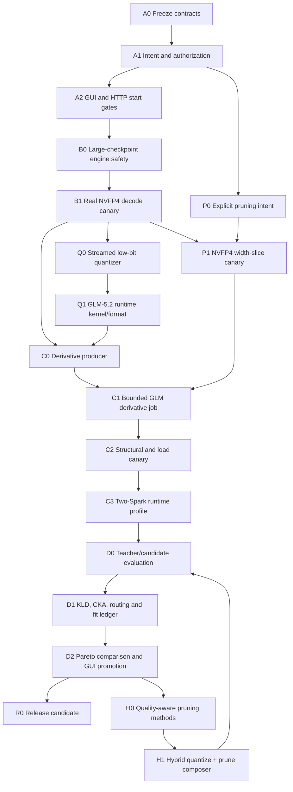

# Atlas compression platform: execution graph

This graph is the release contract for taking a profiled model through an
authorized compression job, a real derivative, runtime validation, and
quality/fit comparison. A node is complete only when its acceptance evidence
exists. Passing unit tests alone does not promote a backend or model.

## Operating model

- The primary orchestrator owns architecture, safety boundaries, cross-module
  contracts, integration, release decisions, and real-model commands.
- Workers receive one bounded file/test scope and a concrete acceptance
  contract. They implement mechanical adapters, schemas, tests, or docs.
- Independent audit workers are read-only. They attack the exact seam changed
  by the builder and return GO/NO-GO with a reproducible reason.
- No worker runs the full suite repeatedly. Focused tests run during a slice;
  one broader suite runs at an integration boundary.
- A backend stays unavailable until a pinned probe, real derivative, structural
  validation, and runtime evidence support its declared status.
- Quantization, pruning, and hybrid methods are distinct effects. A structural
  width slice must never be presented as quantization or as quality-aware
  pruning.

## Critical-path DAG

## Node contracts

| Node | Owner | Deliverable | Acceptance evidence |
|---|---|---|---|
| A0 | primary | Single method catalog and typed recipe effects | Unknown methods and family/effect mismatches fail closed |
| A1 | primary | Intent-bound token, profile/source/calibration identity, immutable plan | Quantize/prune/hybrid/custom drift and malformed identity attacks rejected |
| A2 | worker + audit | Strategy UI, exact blockers, preview/start revalidation | HTTP, GUI, and direct-start adversarial tests green |
| B0 | primary | Streaming CAS, F8 support, source context, bounded source checks | No large `read_bytes`; one initial and one final full source hash; zero publication after mutation |
| B1 | primary | Bounded ModelOpt-NVFP4 row decoder | Real GLM row matches independent decode; byte/element caps enforced |
| P1 | worker + audit | `atlas_nvfp4_width_slice` pruning backend | Tiny real-format derivative; source unchanged; exact pruning declaration; structural validation |
| Q0 | primary | Pinned no-pruning derivative producer | Real source accepted; bounded memory; content-addressed output; no simulated success |
| Q1 | primary | Exact GLM-5.2 serving compatibility | One-layer/kernel parity, then full checkpoint load; unsupported architecture blocks truthfully |
| C1 | primary | Durable real GLM job | Resume/interruption proof, source and output hashes, complete lineage |
| C2 | primary | Load and deterministic forward canary | Runtime loads exact derivative and produces finite repeatable logits |
| C3 | primary | Two-rank runtime/fit ledger | Measured rank occupancy, peak memory, KV budget, throughput, comm and headroom |
| D0 | worker | Versioned evaluation handoff and reports | Teacher/candidate/corpus/tokenizer/config hashes are bound |
| D1 | primary + audit | Per-token KLD, domain tails, CKA, routing divergence | Identity control near zero; alignment/mask failures reject; measured evidence digests |
| D2 | worker | Candidate table, Pareto frontier, promote-to-preview | Missing axes exclude candidates; directions/marginals correct; GUI shows evidence |
| H0 | research workers | TENP/FlexMoE/REAP-style opt-in plugins | Each method isolated, cited, capability-pinned and evaluated against same holdout |
| H1 | primary | Hybrid composer and compatibility matrix | Actual compiled effects contain required families; incompatible formats block |
| R0 | primary | Reproducible open-source release candidate | Clean checkout reproduces plan, derivative validation, runtime and evaluation reports |

## Parallel waves

1. **Closed foundation:** A0, A1, A2, B0, B1.
2. **Current wave:** P1 mechanical pipeline canary runs in parallel with Q0/Q1
   feasibility and runtime work. P1 does not satisfy Q0.
3. **Real-model wave:** C1 and C2 are sequential per derivative; evaluation
   schemas and fit-ledger UI may build concurrently.
4. **Evidence wave:** C3, KLD/CKA/routing aggregation, and comparison UI run in
   parallel after a loadable candidate exists.
5. **Expansion wave:** quality-aware pruning plugins and hybrid composition begin
   only after the quant-only canary has a stable evaluation baseline.

## Worker prompt contract

Every delegated build prompt must contain:

1. exact node and parent commit;
2. allowed files and forbidden services/artifacts;
3. truthful capability/status claims;
4. required failure behavior and adversarial cases;
5. focused test commands and a no-full-suite instruction;
6. first-edit deadline and instruction to report a blocker instead of rereading;
7. one surgical commit and clean-worktree requirement.

The orchestrator performs the cross-node integration, launches real model jobs,
runs the single integration suite, and decides whether evidence permits status
promotion.

## Immediate release sequence

1. Register and test the NVFP4 width-slice backend as an explicit pruning
   canary.
2. Run a tiny synthetic job, then a bounded real GLM shard/checkpoint canary.
3. Validate/load the existing W64 checkpoint as an imported historical
   candidate without claiming the job produced it.
4. Complete the no-pruning producer/runtime decision. If EXL3 cannot accept the
   NVFP4 source or serve GLM-5.2 on SM121, keep it blocked and implement the
   selected streamed format rather than relabeling a pruning artifact.
5. Run the real two-Spark load/profile, then the teacher/candidate KLD and Pareto
   loop.

## Stop conditions

- Never promote on a fake adapter, placeholder probe, synthetic-only evidence,
  missing source/tokenizer/corpus hashes, or a structurally incomplete output.
- Never continue a job after source-integrity, authorization, effect-family,
  backend-pin, checkpoint, or runtime-compatibility failure.
- Never call a candidate quantize-only when any compiled stage has a pruning
  effect.
- Never claim model fit from artifact bytes alone; require measured per-rank
  runtime occupancy and headroom.
